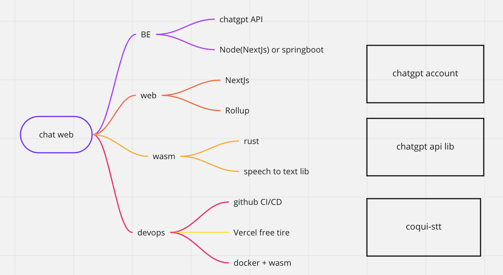

This is a workshop project to create a chat bot using API provided by [chatgpt](https://openai.com/blog/chatgpt/).
Some new and fun tech is introduced to make this happen, including as bellow. Practice and have fun!
- NextJs
- Typescript
- Rust
- WASM
- Docker+WASM
- ChatGpt
- Coqui-stt speech to text engine

## Workshop Overview
 

## Environment
- NodeJs 18+

## Get Started

1. Add .env file at root of project, configure the ENV variables
```
OPENAI_EMAIL={your openAI account email} 
OPENAI_PASSWORD={your openAI account pwd}
```
2. Run dev
```bash
npm run dev
```
Open [http://localhost:3000](http://localhost:3000) with your browser to see the result.